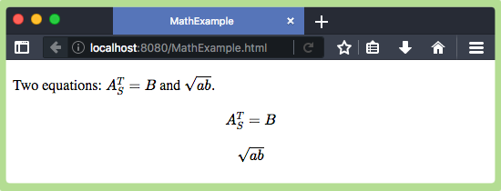
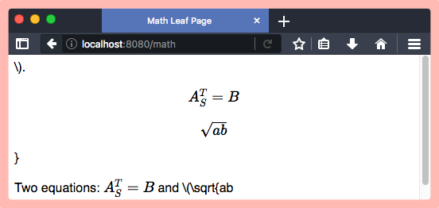

# issue-vapor-leaf-latex

<p align="center">
    <a href="http://docs.vapor.codes/3.0/">
        
    </a>
    <a href="LICENSE">
        
    </a>
    <a href="https://swift.org">
        
    </a>
</p>

[MathJax](https://www.mathjax.org/) is a JavaScript display engine for mathematics that works in all browsers. However, the [Vapor Leaf](https://github.com/vapor/leaf) and [MathJax](https://www.mathjax.org/) combination does not render math expressions correctly.

The example code for this issue is in the GitHub [VaporExamplesLab/issue-vapor-leaf-mathjax](https://github.com/VaporExamplesLab/issue-vapor-leaf-mathjax) repository.  Also submitted [vapor/leaf/issues/133](https://github.com/vapor/leaf/issues/133).

### Steps to reproduce

<!-- Tell us how to reproduce this issue. -->
<!-- Please provide as much detail as possible (the more code snippets, the better)! -->
<!-- If we cannot recreate it, we will not be able to figure out how to fix it. -->


``` bash
vapor new issue-vapor-leaf-latex --web
cd issue-vapor-leaf-latex
vapor update -y
```

_routes.swift_ (Add `math` test route.)

``` swift
// :ADD: math
router.get("math") { req -> Future<View> in
    return try req.view().render("math")
}
```

_Resources/Views/base.leaf_ (Add MathJax to existing base.leaf.)

``` html
<!DOCTYPE html>
<html>
<head>
	<title>#get(title)</title>
	<link rel="stylesheet" href="/styles/app.css">
</head>
<body>
    #get(body)
    
    <!-- MathJax: https://www.mathjax.org/#gettingstarted -->
    <script src='https://cdnjs.cloudflare.com/ajax/libs/mathjax/2.7.5/MathJax.js?config=TeX-MML-AM_CHTML' async></script>
</body>
</html>
```

_Resources/Views/math.leaf_ (Added leaf file.)

``` html
#set("title") {Math Leaf Page}

#set("body") {
	<p>Two equations: \(A^T_S = B\) and \(\sqrt{ab}\).</p>
    <p>\[A^T_S = B\]  </p>
    <p>\[\sqrt{ab}\]  </p>
}

#embed("base")
```

### Expected behavior

_Public/MathExample.html_ (working example)

``` html
<!DOCTYPE html>
<html>
<head>
  <title>MathExample</title>
</head>

<body>

    <p>Two equations: \(A^T_S = B\) and \(\sqrt{ab}\).</p>
    <p>\[A^T_S = B\]  </p>
    <p>\[\sqrt{ab}\]  </p>

    <!-- MathJax: https://www.mathjax.org/#gettingstarted -->
    <script src='https://cdnjs.cloudflare.com/ajax/libs/mathjax/2.7.5/MathJax.js?config=TeX-MML-AM_CHTML' async></script>
</body>
</html>
```



### Actual behavior



Resulting source as seen in browser:

``` html
\).</p>
    <p>\[A^T_S = B\]  </p>
    <p>\[\sqrt{ab}\]  </p>
}

<!DOCTYPE html>
<html>
<head>
	<title>Math Leaf Page</title>
	<link rel="stylesheet" href="/styles/app.css">
</head>
<body>
    
	<p>Two equations: \(A^T_S = B\) and \(\sqrt{ab
    
    <!-- MathJax -->
    <!-- https://www.mathjax.org/#gettingstarted -->
    <!-- config=TeX-MML-AM_CHTML (standard) | config=TeX-AMS_SVG (SVG)-->
    <script src='https://cdnjs.cloudflare.com/ajax/libs/mathjax/2.7.5/MathJax.js?config=TeX-MML-AM_CHTML' async></script>
    <!-- script src='https://cdnjs.cloudflare.com/ajax/libs/mathjax/2.7.5/latest.js?config=TeX-AMS_SVG' async></script -->
</body>
</html>
```

### Environment

* Vapor Framework version: 3.3.0
* Vapor Toolbox version: 3.1.10
* OS version: macOS High Sierra 10.13.6, Xcode 10.1, Swift 4.2
